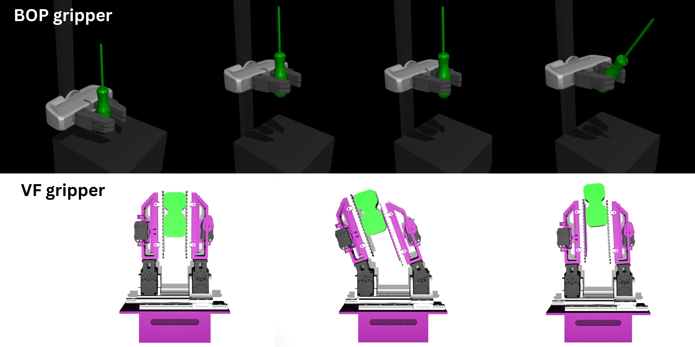

# Active Surface MuJoCo Simulation Platform


This repository contains the MuJoCo-based simulation platform developed for our manipulation research paper.  
It supports regrasping and in-hand manipulation tasks with active surface grippers and object-centric task definitions.

## Features
- MuJoCo models for active surface grippers, Variable friciton gripper and Belt-orienting Phalanges  
- Lightweight evaluation and visualization scripts  

## Installation

### Conda (recommended)
```bash
conda env create -f environment.yml
conda activate mujoco_env
```

### Pip 
```bash
pip install -r requirements.txt
```
 
##  Repository Structure
```text
mujoco-active-surface/
│
├── assets/ # Meshes and CAD models
│ ├── BOP_CAD/ # CAD models for BOP gripper
│ ├── VF_CAD/ # CAD models for VF gripper
│ ├── Object_Assets/ # Simple test objects
│ └── YCB_Objects_Test_Cases/ # YCB object models
│
├── mujoco/ # MuJoCo MJCF/XML models
│ ├── XML_files_for_gripper/ # Gripper XML definitions
│ ├── test_cases/ # Task-specific MuJoCo setups
│ └── scenes/ # Complete simulation scenes
│
├── scripts/ # Run, evaluation, and visualization scripts
│ ├── BOP/ # Scripts for BOP gripper experiments
│ └── VF/ # Scripts for VF gripper experiments
│
├── configs/ # YAML/JSON configuration files
├── docs/ # Diagrams, videos, and additional documentation
│
├── requirements.txt # Python dependencies
├── README.md # Project overview and instructions
├── LICENSE # License information
└── CITATION.cff # Citation metadata
```

## Run a minimal example:
VF experiments
```bash
python .\scripts\VF\vf_experiments.py
```

BOP experiments
```bash
python .\scripts\BOP\BOP_experiments.py
```

### Citation
TBD


### License
MIT License
